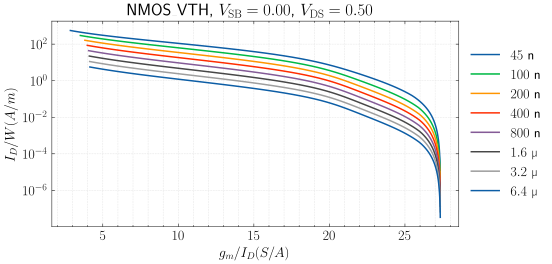
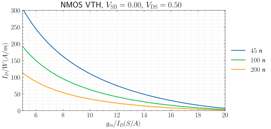
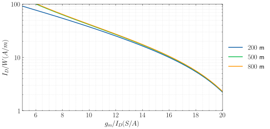
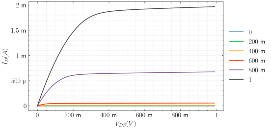

# MOSFET Characterization in Python

## Motivation

This tool has the following goals:

1. Provide an easy and intuitive way of creating plots of MOSFET parameters.
   Since all relevant MOS parameters are available, all sorts of plots can be
   made; for example, those used in the gm/ID design methodology.

2. Provide a tool that doesn't depend on any proprietary software or
   require licensing fees.

3. Open source so that it can be easily modified by the user to suit his/her
   needs.

## Installation

This tools is written in Python and requires the following packages:

- [`PySpice`](https://pypi.org/project/PySpice/) for providing an interface
  between Python and the open-source [`ngspice`](https://ngspice.sourceforge.io/)
  simulator.
- `Numpy`, `Scipy`, and `Matplotlib` for data analysis and plotting.

Note that installing `PySpice` installs `Numpy`, `Scipy`, and `Matplotlib`. So, it is
only necessary to install `PySpice`.

`PySpice` can be installed the conventional way with `pip`. However, if you
prefer to have an isolated environment with `conda`, the required steps are
listed below.

- `conda create -n pytorch`
- `conda activate pytorch`
- `conda install -c conda-forge pytorch`
- `conda install -c conda-forge ngspice ngspice-lib`
- `conda install ipykernel`
- `ipython kernel install --user --name=pytorch`

## Generating a Lookup Table

Before any plots can be made, a lookup table of all the relevant parameters
must first be created. This is done by instantiating an object from the
`LookupTableGenerator` and then building the table with the `build` method. An
example is given below. It took less than a minute on my i7-6700HQ CPU.

```python
obj = LookupTableGenerator (
    vgs=(0, 1, 0.01),
    vds=(0, 1, 0.05),
    vsb=(0, 1, 0.1),
    width=10e-6,
    lengths=[50e-9, 100e-9, 200e-9, 400e-9, 800e-9, 1.6e-6, 3.2e-6, 6.4e-6],
    models_path="./models",
    model_names={
        "nmos": "NMOS_VTH",
        "pmos": "PMOS_VTH"},
    description="freepdk 45nm"
    )
obj.build("./freepdk45_lookup_table.npy")
```

- `vgs`, `vds`, and `vsb` are tuples of the form `(start, stop, step)` and
  define the range of voltages across the gate, drain, and source terminals of
  the MOSFET respectively.
- The `length` can be provided as a list of discrete values. A 1-dimensional
  `numpy` array is also accepted.
- Only a single `width` should be provided. The assumption here is that the
  parameters of the MOSFET scale linearly with the width. Because of this
  assumption, all parameters that are width-dependent must be de-normalized
  with respect to the current or width that you're working with.
- The directory of where the model files are stored is specified via
  `model_path`. The model names are provided in a dictionary format, as shown
  above. Note that `PySpice` requires the file containing the models to have
  the same name as one of the models used. This is only a slight inconvenience.

### Making Plots and Calculating Parameters from the Lookup Table

Because of the interactive nature of designing analog circuits, using this
script within a `jupyter` notebook is highly recommended.

We begin by making the following imports.

```python
from gmid import GMID, load_lookup_table
```

The `load_lookup_table` function loads a lookup table such as the one generated
in the previous section.

```python
lookup_table = load_lookup_table("./freepdk45_lookup_table.npy")
```

The `GMID` class contains methods that can be used to generate plots
seamlessly. We start by creating an object called `nmos` that selects the
`nmos` from the lookup table and specifies the source-bulk and drain-source
voltages to some fixed values. Since the data is 4-dimensional, it is necessary
to fix two of the variables at the time to allow 2-dimensional plotting.

```python
nmos = GMID(lookup_table, mos="nmos", vsb=0.0, vds=0.5)
```

Since it is very common to plot the current-density ($I_{D}/W$), the intrinsic
gain ($g_m / g_{ds}$), the transit frequency ($f_{T}$), and the Early-Voltage
($V_{A}$), with respect to the $g_{m}/I_{D}$ control variable, methods are available
for all these plots.

```python
nmos.current_density_plot()
```



When the lookup table includes a lot of lengths, the plot can become crowded.
You can pass a list of lengths to plot with the `length` parameter.

Use `nmos.lengths` to get a list of all the lengths in the lookup table.

```
array([5.0e-08, 1.0e-07, 2.0e-07, 4.0e-07, 8.0e-07, 1.6e-06, 3.2e-06,
       6.4e-06])
```


Passing a filtered list to the `current_density_plot` method.

```python
nmos.current_density_plot(
    lengths = [5.0e-08, 1.0e-07, 2.0e-07]
)
```


Note that the tool does its best to determine how to scale the axes. For
example, in the last plot, it decided to use a `log` scale on the y-axis. We
can easily overwrite that.

```python
nmos.current_density_plot(
    lengths = [5.0e-08, 1.0e-07, 2.0e-07],
    y_scale = 'linear',
    x_limit = (5, 20),
    y_limit = (0, 300),
)
```




Now, suppose we want to plot something completely custom. The example below
shows how.

```python
nmos.plot_by_expression(
    x_axis = nmos.vgs_expression,
    y_axis = {
        "variables": ["id", "gds"],
        "function": lambda x, y: x / y,
        "label": "$I_D / g_{ds} (A/S)$"
        },
)
```


In the example below, we want $V_{GS}$ to be on the x-axis. Since this is such
a commonly-used expression, it is already defined in the code. Other
commonly-used expressions such as the ones for gmid, gain, and transit
frequency are also defined.

For the y-axis, we want a custom expression that uses the parameters $I_D$ and
$g_{ds}$. This can be done by defining a dictionary that specifies the
variables needed and how to calculate the required parameter. The `label` field
is optional. The function field is also optional if we want to just plot the
parameter.

While having plots is a good way to visualize trends, we might also just be
interested in the value.


Looking at the figure above, it's hard to hard to read exactly the value on the
y-axis for a particular value on the x-axis, especially more so when the scale
is logarithmic.

The snippet below sets the `gmid` to a particular value, sweeps the length over
a range, and calculates the gain. Note that for `expression`, we could have
also used the pre-defined `gain_expression` to avoid having to define one
ourselves. Also note that the `lookup` method uses interpolation for
calculation.

```python
nmos.lookup_by_gmid(
    length=(180e-9, 1000e-9, 100e-9),
    gmid=15,
    expression={
        "variables": ["gm", "gds"],
        "function": lambda x, y: x / y
    })
```

```
array([171.89462638, 244.7708084 , 303.40565751, 331.66760623,
       351.82406495, 370.72068061, 390.86449014, 403.27318566,
       413.74810267])
```

In the previous examples, two of the sources were fixed while the other was
allowed to vary. This is fine for easy plots. We can use the `lookup` method to
get much more sophisticated plots as the `lookup` methods uses the entire
lookup table.

Consider the example below where we want to see the dependence of $I_{D}/W$ on
$g_m / I_{D}$ for different values of $V_{DS}$. This is only possible by
varying two sources at a time.


```python
x = nmos.lookup(
    length = 180e-9,
    vsb = 0,
    vds = (0.2, 1, 0.3),
    vgs = (0.1, 1, 0.01),
    expression = nmos.gmid_expression,
    primary = "vgs"
)

y = nmos.lookup(
    length = 180e-9,
    vsb = 0,
    vds = (0.2, 1, 0.3),
    vgs = (0.1, 1, 0.01),
    expression = nmos.current_density_expression,
    primary = "vgs"
)

nmos.quick_plot(
    x.T,
    y.T,
    x_limit=(5 ,20),
    y_limit=(1, 100)
)
```


If the above code seems a bit too much, there's a wrapper method just for that
with added benefits.

```python
x = nmos.plot_by_sweep(
    length=180e-9,
    vsb = 0,
    vds = (0.2, 1, 0.3),
    vgs = (0.1, 1, 0.01),
    x_axis_expression = nmos.gmid_expression,
    y_axis_expression = nmos.current_density_expression,
    primary = "vgs",
    x_eng_format=True,
    y_eng_format=True,
    y_scale='log',
    x_limit=(5, 20),
    y_limit=(1, 100),
)
```



The `plot_by_sweep` method is extremely flexible and be used to create all
sorts of plots. For example, the snippet below shows how to plot the
traditional output characteristic plot of a MOSFET.

```python
nmos.plot_by_sweep(
    length=180e-9,
    vsb = 0,
    vds = (0.0, 1, 0.01),
    vgs = (0.0, 1, 0.2),
    x_axis_expression = "vds",
    y_axis_expression = "id",
    primary = "vds",
    x_eng_format=True,
    y_eng_format=True,
    y_scale='linear',
    x_label = "$V_{DS} (V)$",
    y_label = "$I_D (A)$"
)
```



